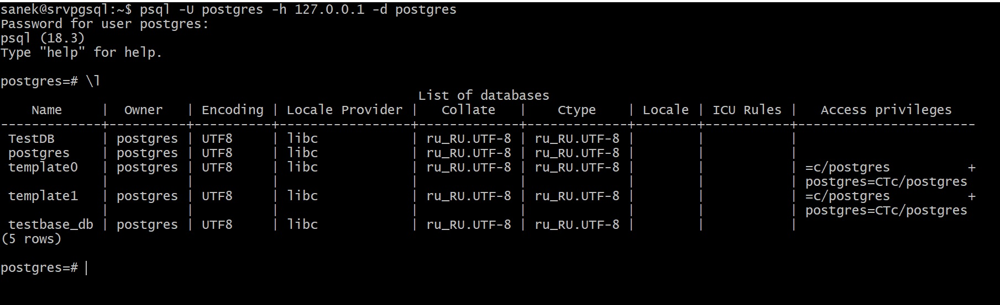
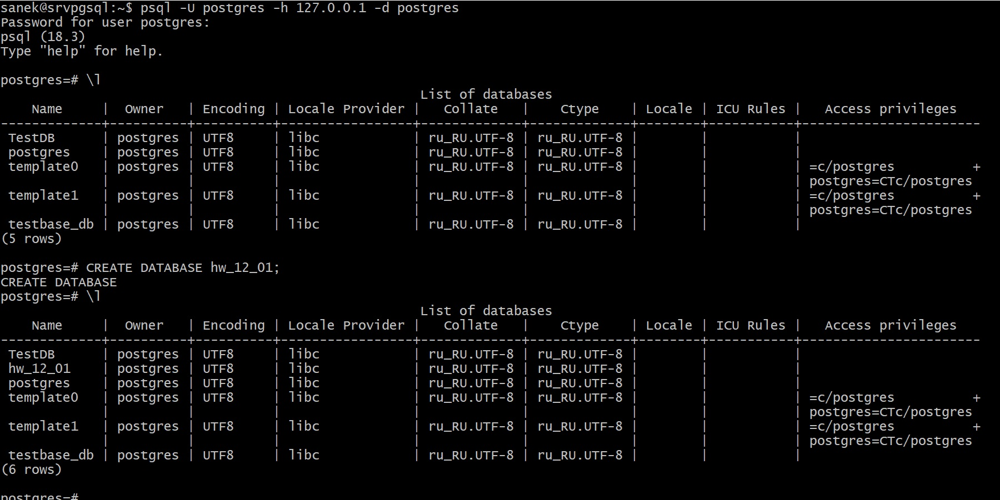
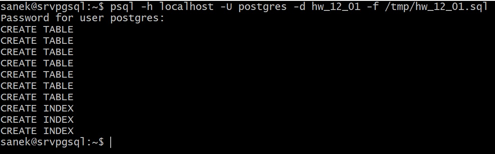
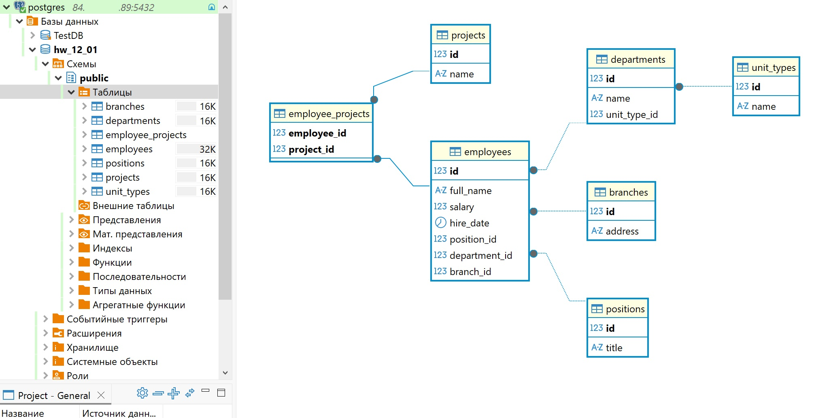

# Домашнее задание к занятию "Базы данных"

## Задание 2

Подключение к postgres:
psql -U postgres -h 127.0.0.1 -d postgres

Список баз до выполнения скрипта.

1. Скрипт создания БД:

CREATE DATABASE hw_12_01;

2. Подключение к БД:

\c hw_12_01;

3. Создание

* Выйти из консоли postgres:

\q

* Сохранить скрипт в файл:

nano hw_12_01.sql && cp hw_12_01.sql /tmp/

-- 1. Создание таблицы филиалов
CREATE TABLE branches (
    id SERIAL PRIMARY KEY,
    address VARCHAR(255) NOT NULL UNIQUE
);

-- 2. Создание таблицы типов подразделений
CREATE TABLE unit_types (
    id SERIAL PRIMARY KEY,
    name VARCHAR(50) NOT NULL UNIQUE
);

-- 3. Создание таблицы структурных подразделений
CREATE TABLE departments (
    id SERIAL PRIMARY KEY,
    name VARCHAR(150) NOT NULL,
    unit_type_id INTEGER NOT NULL,
    FOREIGN KEY (unit_type_id) REFERENCES unit_types(id) ON DELETE RESTRICT,
    CONSTRAINT unique_dept_name_type UNIQUE (name, unit_type_id)
);

-- 4. Создание таблицы должностей
CREATE TABLE positions (
    id SERIAL PRIMARY KEY,
    title VARCHAR(100) NOT NULL UNIQUE
);

-- 5. Создание таблицы проектов
CREATE TABLE projects (
    id SERIAL PRIMARY KEY,
    name VARCHAR(150) NOT NULL UNIQUE
);

-- 6. Создание таблицы сотрудников
CREATE TABLE employees (
    id SERIAL PRIMARY KEY,
    full_name VARCHAR(150) NOT NULL,
    salary NUMERIC(10, 2) NOT NULL CHECK (salary >= 0),
    hire_date DATE NOT NULL,
    position_id INTEGER NOT NULL,
    department_id INTEGER NOT NULL,
    branch_id INTEGER NOT NULL,
    FOREIGN KEY (position_id) REFERENCES positions(id) ON DELETE RESTRICT,
    FOREIGN KEY (department_id) REFERENCES departments(id) ON DELETE RESTRICT,
    FOREIGN KEY (branch_id) REFERENCES branches(id) ON DELETE RESTRICT
);

-- 7. Создание связующей таблицы для сотрудников и проектов (Многие-ко-многим)
CREATE TABLE employee_projects (
    employee_id INTEGER NOT NULL,
    project_id INTEGER NOT NULL,
    PRIMARY KEY (employee_id, project_id),
    FOREIGN KEY (employee_id) REFERENCES employees(id) ON DELETE CASCADE,
    FOREIGN KEY (project_id) REFERENCES projects(id) ON DELETE CASCADE
);

-- Создание индексов для оптимизации частых поисковых запросов и джоинов
CREATE INDEX idx_employees_department ON employees(department_id);
CREATE INDEX idx_employees_position ON employees(position_id);
CREATE INDEX idx_employees_branch ON employees(branch_id);

* Запустить скрипт:

psql -h localhost -U postgres -d hw_12_01 -f /tmp/hw_12_01.sql

Отображение диаграммы созданной БД в DBeaweer:

