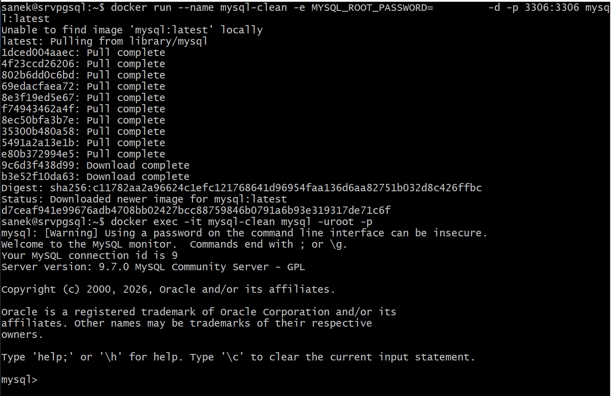
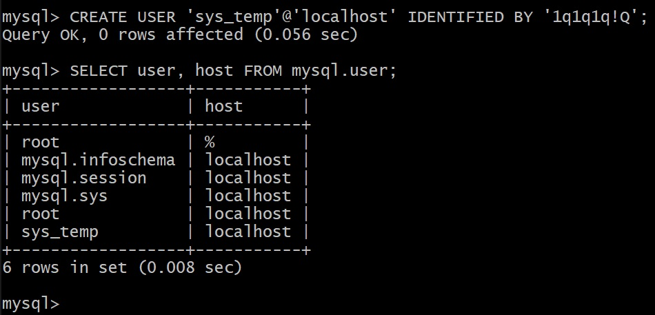
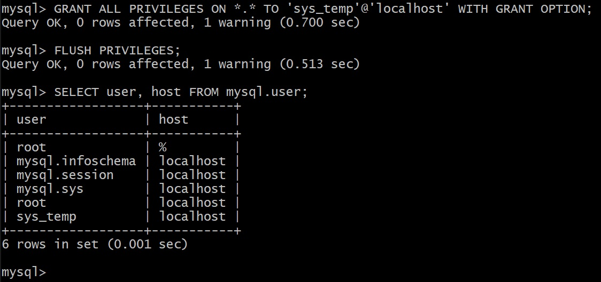
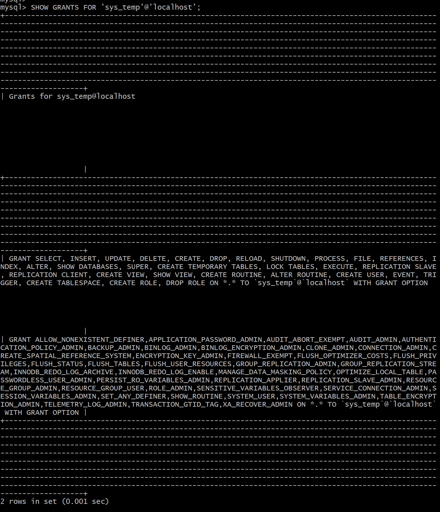
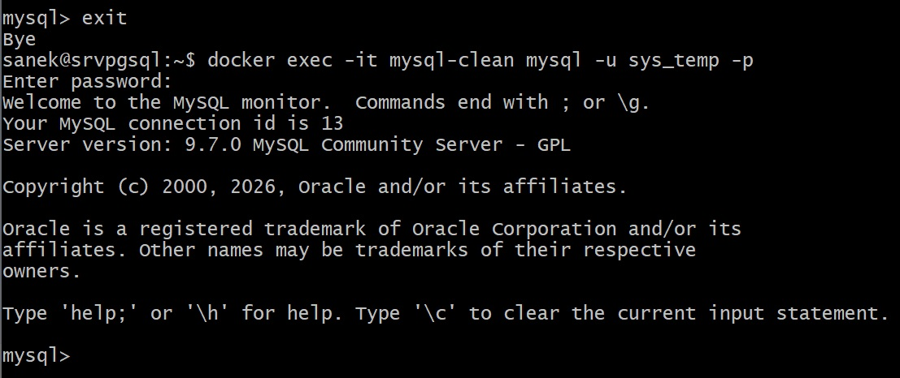
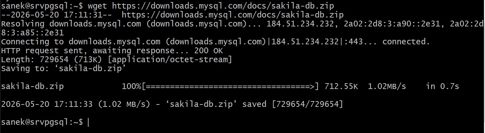
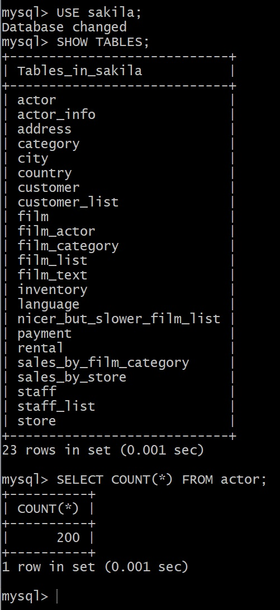
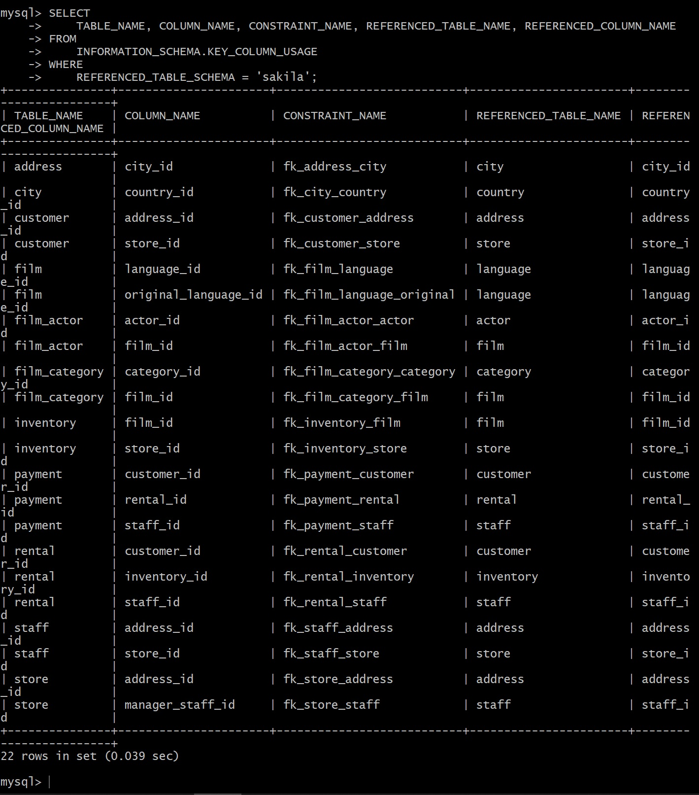
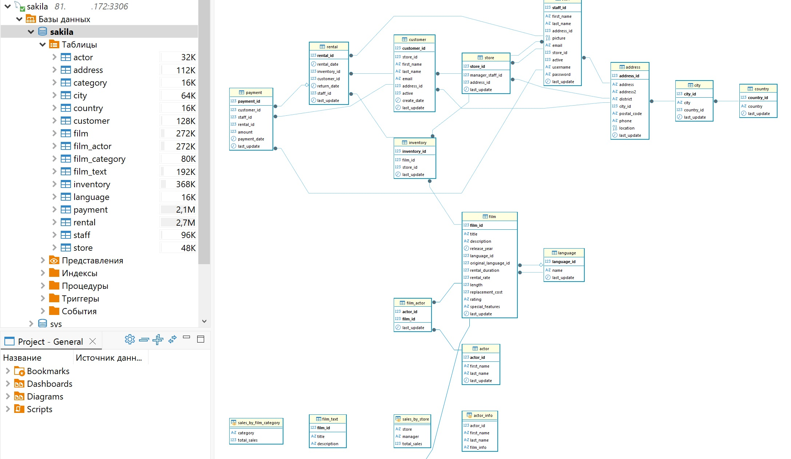
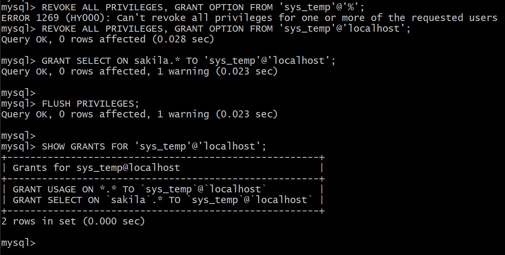

# Домашнее задание к занятию "Работа с данными (DDL/DML)"

## Задание 1

1. Поднимите чистый инстанс MySQL версии 8.0+. Можно использовать локальный сервер или контейнер Docker.

docker run --name mysql-clean -e MYSQL_ROOT_PASSWORD=<my-secret-pw> -d -p 3306:3306 mysql:latest

docker exec -it mysql-clean mysql -uroot -p<my-secret-pw>

2. Создайте учётную запись sys_temp.

* Создание пользователя:

CREATE USER 'sys_temp'@'localhost' IDENTIFIED BY '1q1q1q!Q';

3.  Выполните запрос на получение списка пользователей в базе данных.

SELECT user, host FROM mysql.user;

4. Дайте все права для пользователя sys_temp.

* Выдача полных прав:

GRANT ALL PRIVILEGES ON *.* TO 'sys_temp'@'localhost' WITH GRANT OPTION;

* Обновление прав:

FLUSH PRIVILEGES;

5. Выполните запрос на получение списка прав для пользователя sys_temp.

SELECT user, host FROM mysql.user;

SHOW GRANTS FOR 'sys_temp'@'localhost';

6. Переподключитесь к базе данных от имени sys_temp.

docker exec -it mysql-clean mysql -u sys_temp -p'1q1q1q!Q'

Для смены типа аутентификации с sha2 используйте запрос:

ALTER USER 'sys_test'@'localhost' IDENTIFIED WITH mysql_native_password BY 'password';

7. По ссылке https://downloads.mysql.com/docs/sakila-db.zip скачайте дамп базы данных.

wget https://downloads.mysql.com/docs/sakila-db.zip && unzip sakila-db.zip && cd sakila-db

8. Восстановите дамп в базу данных.

docker exec -it mysql-clean mysql -u sys_temp -p

CREATE DATABASE sakila;

exit

* Импорт структуры таблиц

docker exec -i mysql-clean mysql -u sys_temp -p'1q1q1q!Q' sakila < sakila-schema.sql

* Импорт данных в таблицы

docker exec -i mysql-clean mysql -u sys_temp -p'1q1q1q!Q' sakila < sakila-data.sql

* Проверка создания таблиц

docker exec -it mysql-clean mysql -u sys_temp -p'1q1q1q!Q'

USE sakila;
SHOW TABLES;
SELECT COUNT(*) FROM actor;

9.  При работе в IDE сформируйте ER-диаграмму получившейся базы данных. При работе в командной строке используйте команду для получения всех таблиц базы данных.

* Покажет все таблицы

mysql -u sys_temp -p -e "USE sakila; SHOW TABLES;"

* выведет все связи в консоль

SELECT
    TABLE_NAME, COLUMN_NAME, CONSTRAINT_NAME, REFERENCED_TABLE_NAME, REFERENCED_COLUMN_NAME
FROM
    INFORMATION_SCHEMA.KEY_COLUMN_USAGE
WHERE
    REFERENCED_TABLE_SCHEMA = 'sakila';

## Задание 2

SELECT
    TABLE_NAME AS 'Название таблицы',
    COLUMN_NAME AS 'Название первичного ключа'
FROM
    INFORMATION_SCHEMA.KEY_COLUMN_USAGE
WHERE
    TABLE_SCHEMA = 'sakila'
    AND CONSTRAINT_NAME = 'PRIMARY'
ORDER BY
    TABLE_NAME;

[Решение](./KEY_COLUMN_USAGE_202605202111.json "Выгрузка запроса")

## Задание 3

1. Уберите у пользователя sys_temp права на внесение, изменение и удаление данных из базы sakila.

docker exec -it mysql-clean mysql -u root -p

REVOKE ALL PRIVILEGES, GRANT OPTION FROM 'sys_temp'@'localhost';

GRANT SELECT ON sakila.* TO 'sys_temp'@'localhost';

FLUSH PRIVILEGES;

2. Выполните запрос на получение списка прав для пользователя sys_temp.

SHOW GRANTS FOR 'sys_temp'@'localhost';

