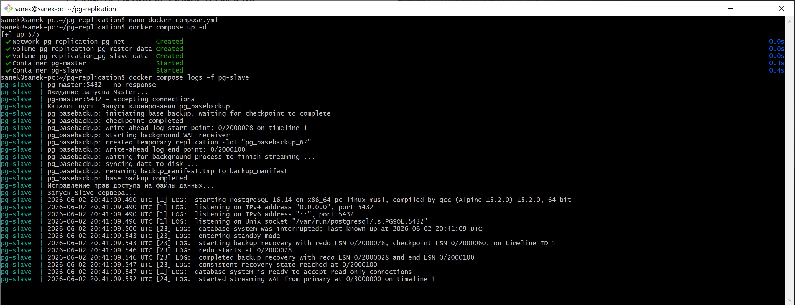
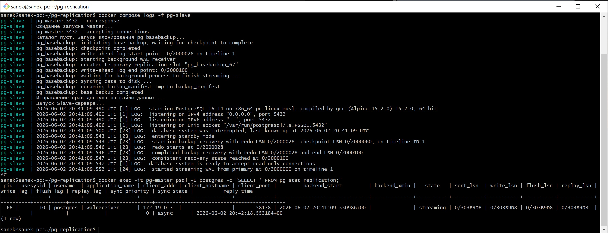
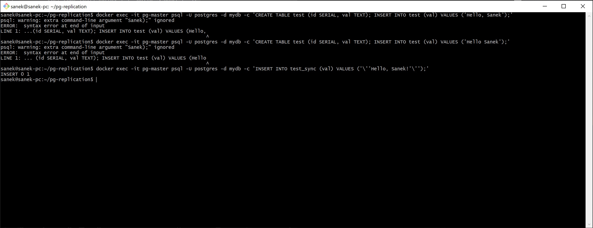
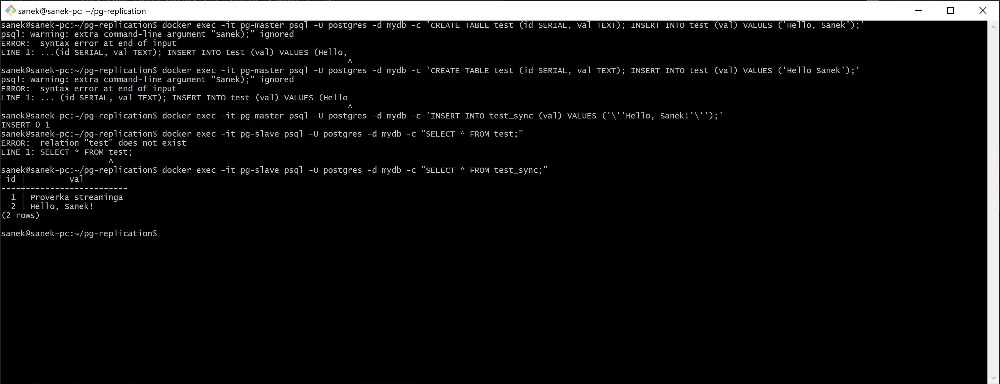
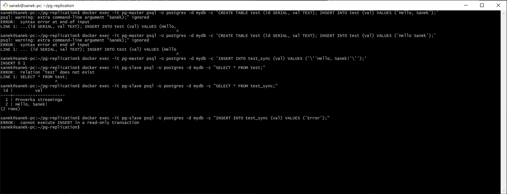

# Домашнее задание к занятию "Репликация и масштабирование"

## Задание 1

Выполните конфигурацию master-slave репликации, примером можно пользоваться из лекции.

1. Подготовка тестовой среды в Docker Compose

mkdir pg-replication && cd pg-replication

* Переместить (mv docker-compose.yml pg-replication/) или отредактировать (nano docker-compose.yml) файл: [docker-compose.yml](./docker-compose.yml)

* Переместить (mv pg_hba.conf pg-replication/) или отредактировать (nano pg_hba.conf) файл: [pg_hba.conf](./pg_hba.conf)

* docker compose up -d

2. Проверка

* Проверка логов процесса клонирования и запуска

docker compose logs -f pg-slave

* Подключение к Master и проверка статуса отправки данных

docker exec -it pg-master psql -U postgres -c "SELECT * FROM pg_stat_replication;"

* Создание таблицы на Master и добавление строки

docker exec -it pg-master psql -U postgres -d mydb -c 'INSERT INTO test_sync (val) VALUES ('\''Hello, Sanek!'\'');'

* Тест чтения на Slave

docker exec -it pg-slave psql -U postgres -d mydb -c "SELECT * FROM test_sync;"

* Попытка записи на Slave

docker exec -it pg-slave psql -U postgres -d mydb -c "INSERT INTO test_sync (val) VALUES ('Error');"

