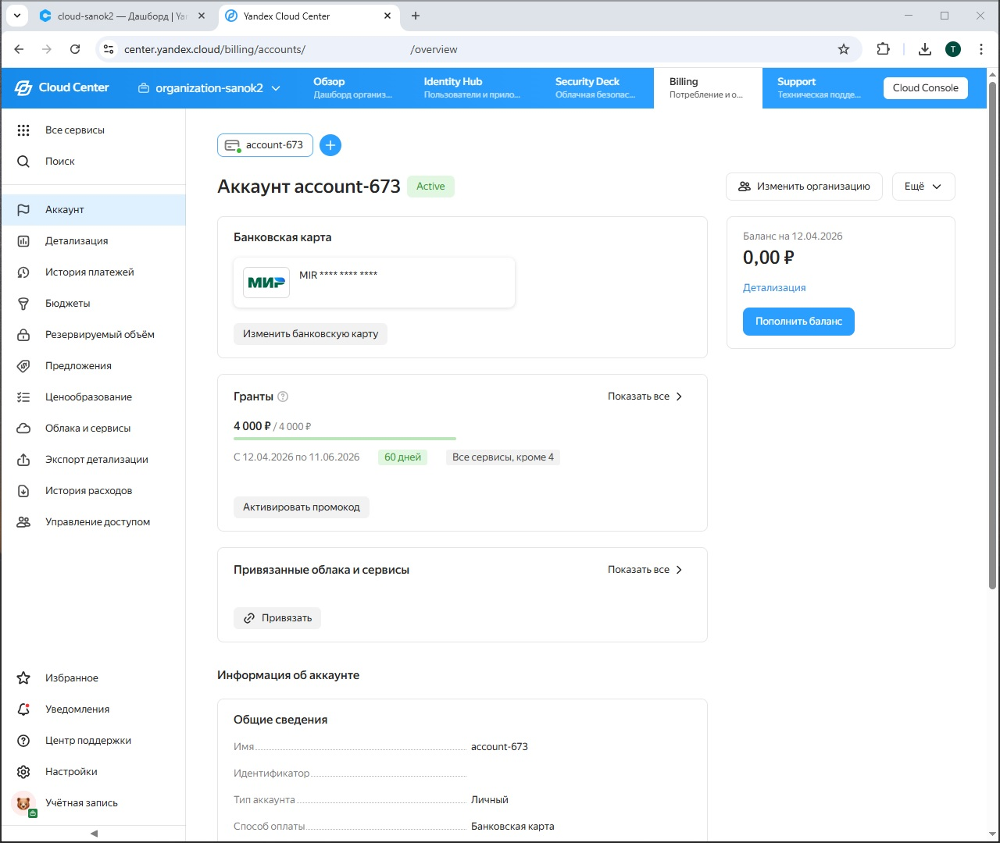
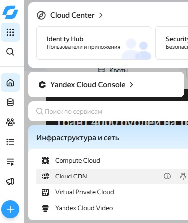
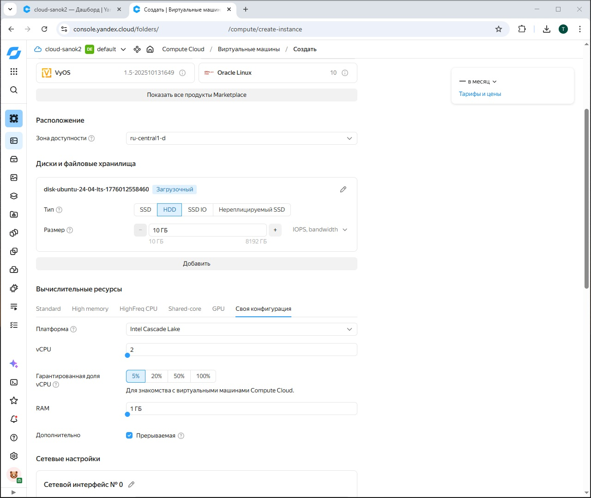
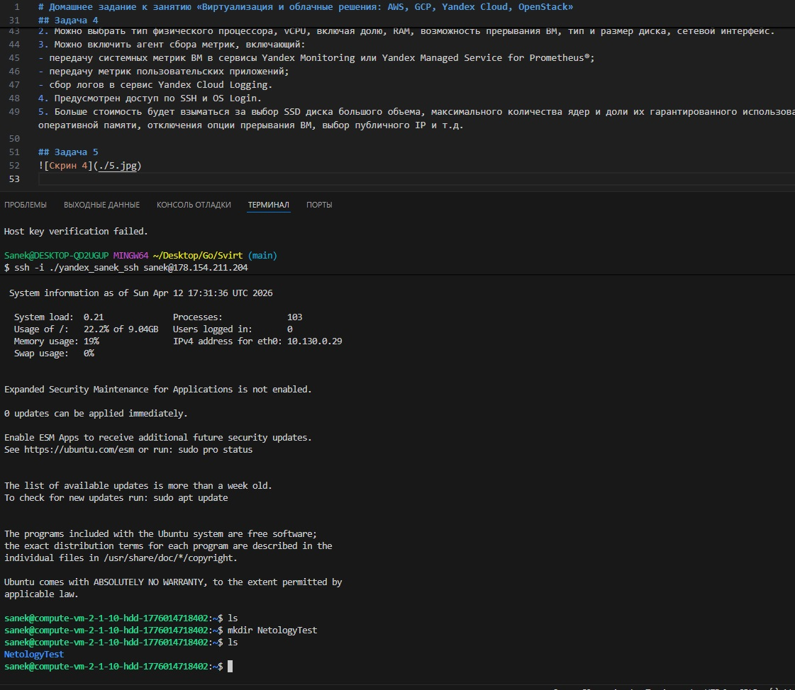

# Домашнее задание к занятию «Виртуализация и облачные решения: AWS, GCP, Yandex Cloud, OpenStack»

## Задача 1

Частное облако подразумевает использование только определенным кругом пользователей.
Общедоступное облако позволяет использовать ресурсы нескольким организациям/объедеинениям(группам) пользователей, объединенных между собой общими целями, задачами, интересами.
Публичное же, подразумевает скорее свободное использование ресурсов неограциченным кругом пользователей в личных интересах.
Гибридное облако использует все виды виртуальных сред, т.е. сочетает в себе все преимущества других видов.

## Задача 2

- IaaS - инфраструктура как услуга. Аренда виртуальных ресурсов (сервера, сети, хранилища). Примеры: Amazon Web Services (AWS) EC2, Microsoft Azure Virtual Machines, Яндекс Облако;
- PaaS - платформа как услуга. Предоставление платформы ля разработки.ю отладки и тестирования. Примеры: Google App Engine, Heroku, Red Hat OpenShift;
- SaaS - ПО как услуга. Предоставление доступа к готовому ПО. Примеры:  Google Workspace (Docs, Gmail), Microsoft Office 365;
- CaaS - контейнеры как услуга. Предоставление доступа к развертыванию контейнеризируемых приложений. Примеры: Google Kubernetes Engine (GKE), Amazon Elastic Kubernetes Service (EKS);
- DRaaS - восстановление после сбоев как услуга. Предоставление услуг по резервному копированию и восстановлению бекапов. Примеры: Veeam Disaster Recovery, Azure Site Recovery;
- BaaS - бэкенд как услуга. Предоставление доступа к инструментам разработчика. Примеры: Firebase (Google), Parse;
- DBaaS - БД как услуга. Облачные базы данных. Примеры: Amazon RDS, MongoDB Atlas;
- MaaS - мониторинг как услуга. Предоставление доступа к системам мониторинга производительности и инфраструктурных событий. примеры: Datadog, Zabbix (в облаке);
- DaaS - рабочий стол как услуга. Виртуализация рабочих мест. Примеры: Amazon WorkSpaces, Azure Virtual Desktop;
- NaaS - сеть как услуга. Предоставление доступа к сетевой инфраструктуре. Примеры: различные сервисы, которые сейчас нельзя называть;
- STaaS - хранилище как услуга. предоставление доступа для хранения данных. Примеры: Google Drive, OneDrive, Яндекс Диск.

## Задача 3

1. Когда всеми процессами управляет провайдер, это SaaS (ПО как услуга).
2. Когда происходит самостоятельное управление ПО и данными, а все остальное обеспечивает провайдер, то это PaaS (платформа как услуга).
3. В случае самостоятельного управления ОС, средой исполнения, данными, приложениями, а остальными процессами провайдер - IaaS (инфраструктура как услуга).
4. Самостоятельное управление всей инфраструктурой возможно только локально, на собственных вычислительных мощностях.

## Задача 4

* Создать платёжный аккаунт:

* После регистрации выбрать меню в консоли Computer cloud:

* Приступить к созданию виртуальной машины:

1. Можно выбрать следующие ОС: Ubuntu , CentOS, Debian, Fedora, VyOS, Oracle Linux. Всего в списке 74 различные версии ОС.
2. Можно выбрать тип физического процессора, vCPU, включая долю, RAM, возможность прерывания ВМ, тип и размер диска, сетевой интерфейс.
3. Можно включить агент сбора метрик, включающий:
- передачу системных метрик ВМ в сервисы Yandex Monitoring или Yandex Managed Service for Prometheus®;
- передачу метрик пользовательских приложений;
- сбор логов в сервис Yandex Cloud Logging.
4. Предусмотрен доступ по SSH и OS Login.
5. Больше стоимость будет взыматься за выбор SSD диска большого объема, максимального количества ядер и доли их гарантированного использования, максимального количества оперативной памяти, отключения опции прерывания ВМ, выбор публичного IP и т.д.

## Задача 5
