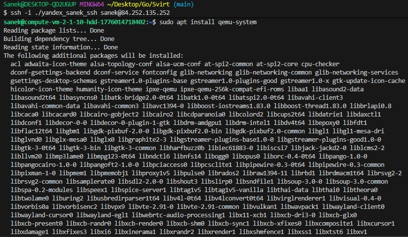
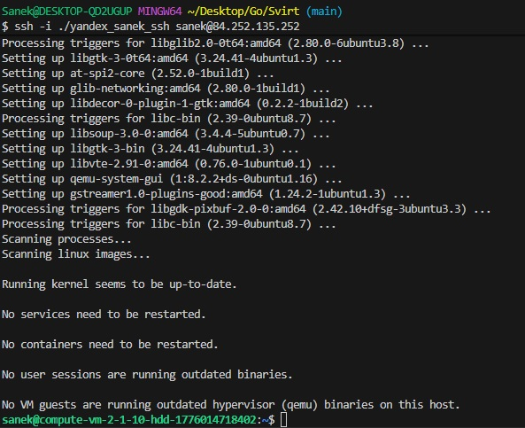
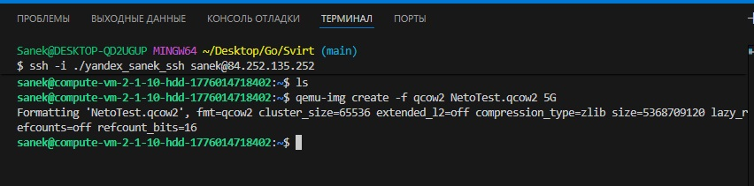
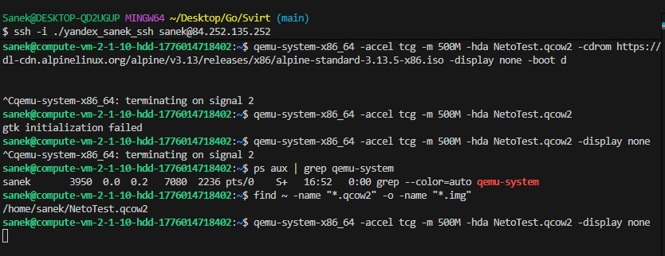
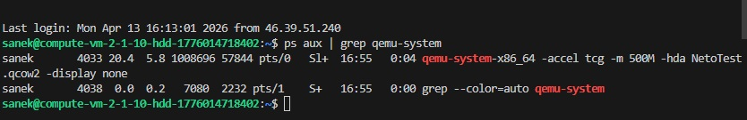
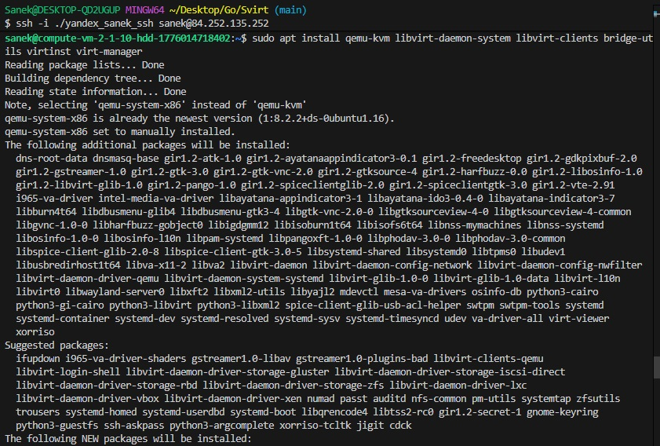
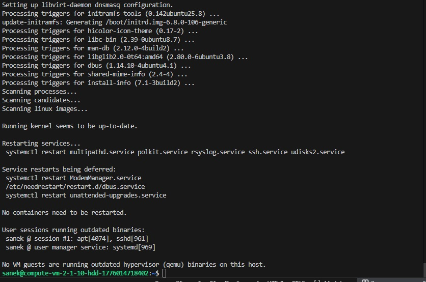
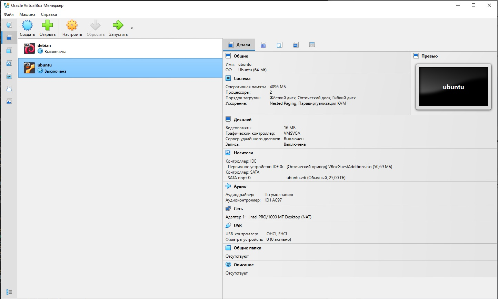
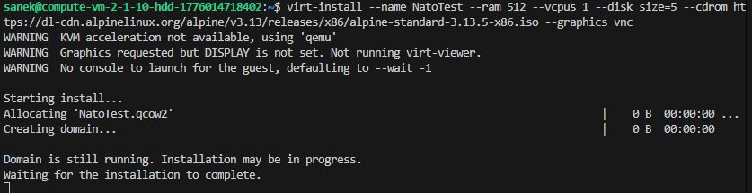
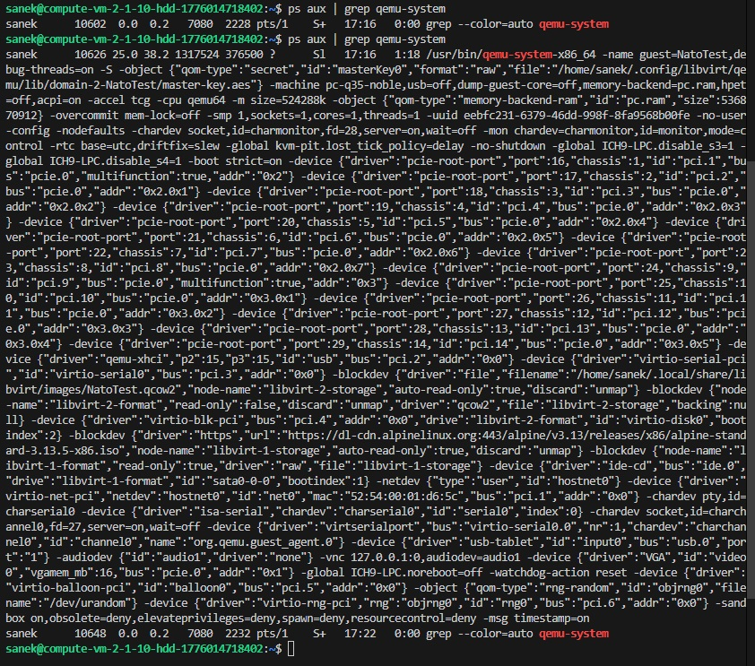

# Домашнее задание к занятию «Типы виртуализации: KVM, QEMU»

## Задача 1

1. Установите QEMU в зависимости от системы.

2. Создайте виртуальную машину.

3. Установите виртуальную машину.

## Задача 2

1. Установите KVM и библиотеку libvirt.

2. Создайте виртуальную машину.
Для личных целей использую графическую оболочку Oracle VirtualBox:

3. Установите виртуальную машину.

## Задача 3

Установка ВМ в Задаче 2 происходила дольше, чем через QEMU. В первую очередь из-за отсутствия поддержки процессором аппаратной виртуализации (для выполния задачи использовалась ВМ на Yandex Cloud).