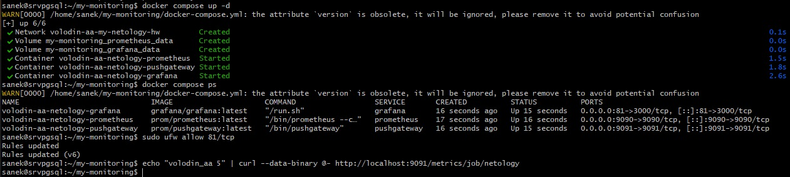
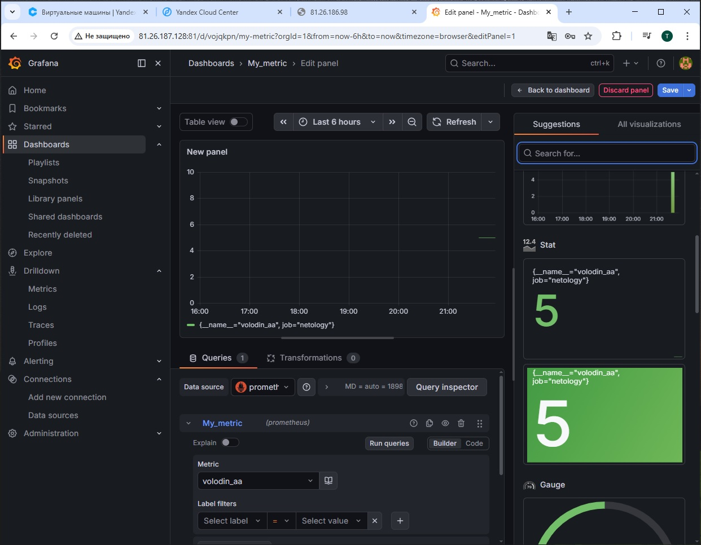
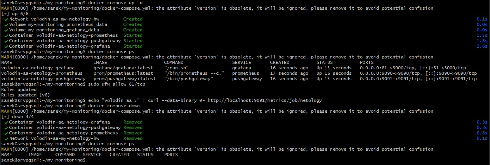
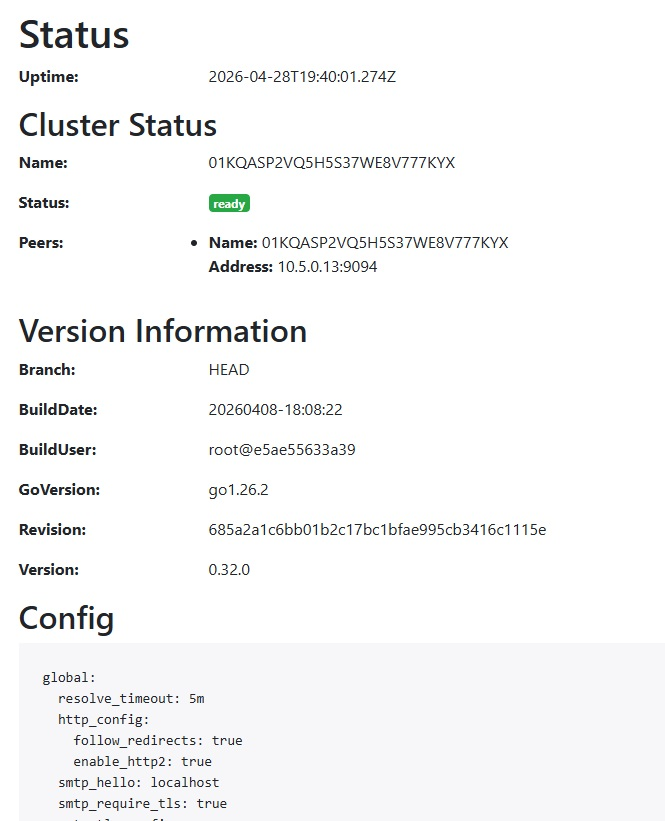

# Домашнее задание к занятию «Docker. Часть 2»

## Задача 1

Docker Compose упрощает запуск и управление сразу несколькими контейнерами в различных средах. Можно создавать собственные файлы конфигурации, например, YAML.
Т.е. чтобы запустить приложение, требующее запуск нескольких контейнеров, не нужно поочередно выполнять команды docker run, а выполнить одну docker compose.
В файде конфигурации описано что и в какой последовательности должеон быть запущено.

## Задача 2

version: '3'
services:
volumes:
networks:
  my-netology-hw:
    name: volodin-aa-my-netology-hw
    driver: bridge
    ipam:
    config:
      - subnet: 10.5.0.0/16
gateway: 10.5.0.1

## Задача 3

version: '3'
services:
  prometheus:
    image: prom/prometheus:latest
    container_name: volodin-aa-netology-prometheus
    ports:
      - "9090:9090"
    networks:
      volodin-aa-my-netology-hw:
        ipv4_address: 10.5.0.10
    volumes:
      # 1. Проброс файла конфигурации (из папки с проектом в контейнер)
      # :ro (read-only), чтобы не затереть исходны файл
      - ./prometheus.yml:/etc/prometheus/prometheus.yml:ro
      # 2. Проброс именованного тома для данных (чтобы метрики не удалялись)
      - prometheus_data:/prometheus
networks:
  my-netology-hw:
    name: volodin-aa-my-netology-hw
    driver: bridge
    ipam:
    config:
      - subnet: 10.5.0.0/16
gateway: 10.5.0.1
volumes:
  prometheus_data:

## Задача 4

pushgateway:
    image: prom/pushgateway:latest
    container_name: volodin-aa-netology-pushgateway
    ports:
    - "9091:9091"
    networks:
    volodin-aa-my-netology-hw:
        ipv4_address: 10.5.0.11
    restart: always

## Задача 5

grafana:
    image: grafana/grafana:latest
    container_name: volodin-aa-netology-grafana
    ports:
      - "80:3000"
    environment:
      - GF_PATHS_CONFIG=/etc/grafana/custom.ini
    volumes:
      - grafana_data:/var/lib/grafana
      - ./custom.ini:/etc/grafana/custom.ini:ro
    networks:
      volodin-aa-my-netology-hw:
        ipv4_address: 10.5.0.12
    restart: always

## Задача 6

Добавлены разделы depends_on: для pushgateway и grafana. Раздел restart: always был сразу добавлен.

## Задача 7

Файл docker-compose.yml приложен отдельно в репозитории.

## Задача 8

## Задача 9

## Задача 10

Все описанные действия по данному ДЗ выполнялись в YandexCloud на ВМ, на которой установлена СУБД Postgres.
Для себя составил такую шпаргалку:

### Установка Docker

1. Установка
   sudo apt update
   sudo apt install docker.io -y

2. Запуск службы

sudo systemctl enable --now docker

3. Настройка Post-install

sudo groupadd docker

sudo usermod -aG docker $USER

4. Чтобы не перезагружать компьютер, можно обновить права в текущей сессии терминала:

newgrp docker

5. Проверка

docker run hello-world

6. Установка Docker Compose

sudo apt-get update && sudo apt-get install ca-certificates curl gnupg

sudo install -m 0755 -d /etc/apt/keyrings
curl -fsSL https://download.docker.com/linux/ubuntu/gpg | sudo gpg --dearmor -o /etc/apt/keyrings/docker.gpg
sudo chmod a+r /etc/apt/keyrings/docker.gpg

echo \
  "deb [arch=$(dpkg --print-architecture) signed-by=/etc/apt/keyrings/docker.gpg] https://download.docker.com/linux/ubuntu \
  $(. /etc/os-release && echo "$VERSION_CODENAME") stable" | \
  sudo tee /etc/apt/sources.list.d/docker.list > /dev/null

sudo apt-get update && sudo apt-get install docker-compose-plugin

7. Проверка

docker compose version

### Запуск системы мониторинга

1. Перенос конфигурации на сервер

ssh -i <файл_ключа> пользователь@ip-сервера "mkdir -p ~/my-monitoring"

scp -i <файл_ключа> docker-compose.yml prometheus.yml custom.ini <username>@<IP_сервера>:~/my-monitoring

2. Запуск

cd ~/my-monitoring
docker compose up -d

3. Проверка

docker compose ps
docker logs volodin-aa-netology-grafana

Grafana: http://<IP_сервера>:80
Prometheus: http://<IP_сервера>:9090

4. Остановка

docker compose down