# Домашнее задание к занятию «Kubernetes. Часть 1»

## Задача 1

1. Запустите Kubernetes локально, используя k3s или minikube на свой выбор.

* Установка Minikube
cd ~ && wget -O minikube.deb https://github.com/kubernetes/minikube/releases/latest/download/minikube-linux-amd64

cd ~ && sudo install minikube.deb /usr/local/bin/minikube

* Установка kubectl

sudo snap install kubectl --classic

* Запуск локального кластера

minikube start

* Проверка работы

kubectl get nodes

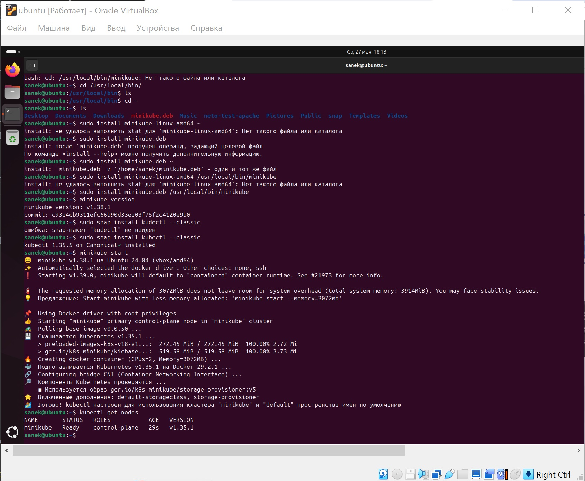

* Остановка и удаление

minikube stop
minikube delete

2. Добейтесь стабильной работы всех системных контейнеров.

* Создаем группу docker (если она еще не создана)

sudo groupadd docker

* Добавляем вашего текущего пользователя в эту группу

sudo usermod -aG docker $USER

* Применяем изменения прав немедленно без перезагрузки системы

newgrp docker

* Первый чистый запуск Minikube

minikube delete
minikube start --driver=docker --addons=ingress,dashboard

* Проверка стабильности системных контейнеров

kubectl get pods -n kube-system

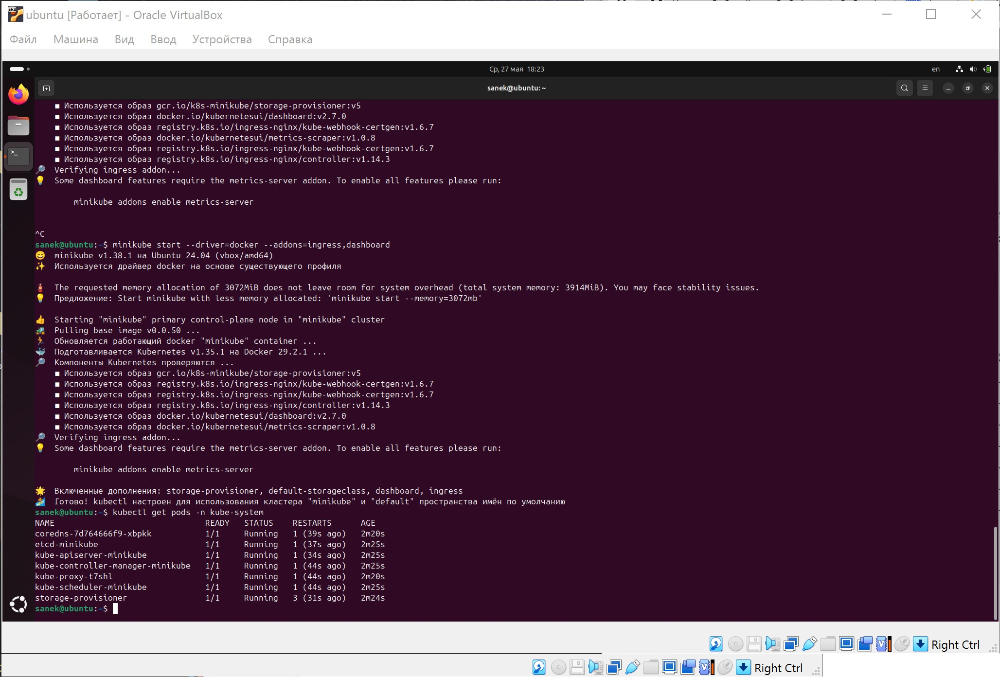

## Задача 2

1. Измените [файл](redis-app-base.yaml) с учётом условий:

* redis должен запускаться без пароля;
* создайте Service, который будет направлять трафик на этот Deployment;
* версия образа redis должна быть зафиксирована на 6.0.13.

[Измененный файл](redis-app.yaml)

2. Запустите Deployment в своём кластере и добейтесь его стабильной работы.

* Локальное скачивание образа через Docker

docker pull redis:6.0.13

* Перенос образа внутрь Minikube

minikube image load redis:6.0.13

* Запуск деплоймента

kubectl apply -f redis-app.yaml

В консоль должно вывестись:

deployment.apps/redis created
service/redis-service created

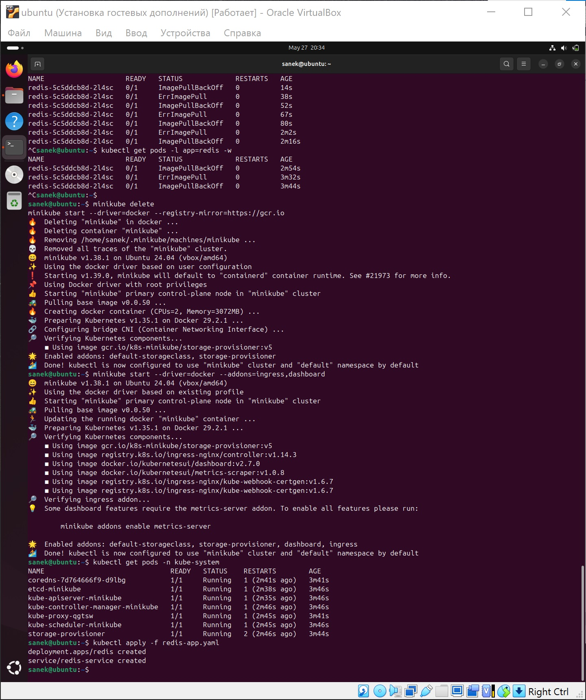

* Контроль стабильности и проверка работы

kubectl get pods -l app=redis -w

Дождитесь, пока статус изменится на Running, а в столбце READY появится 1/1. Чтобы выйти из режима мониторинга, нажмите Ctrl + C.

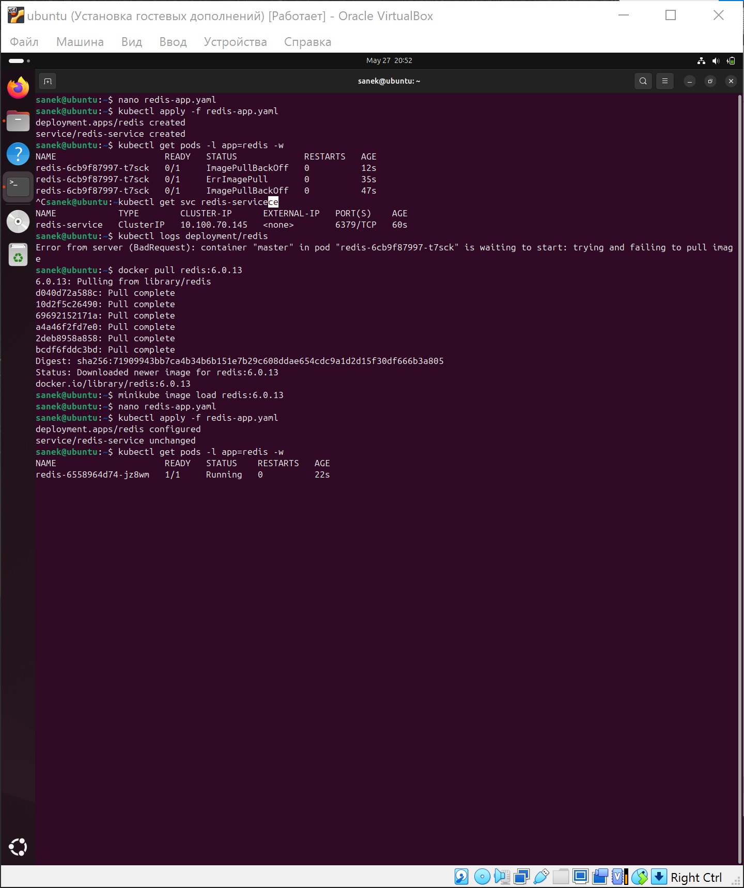

Убедитесь, что служба создана и имеет внутренний IP-адрес.

kubectl get svc redis-service

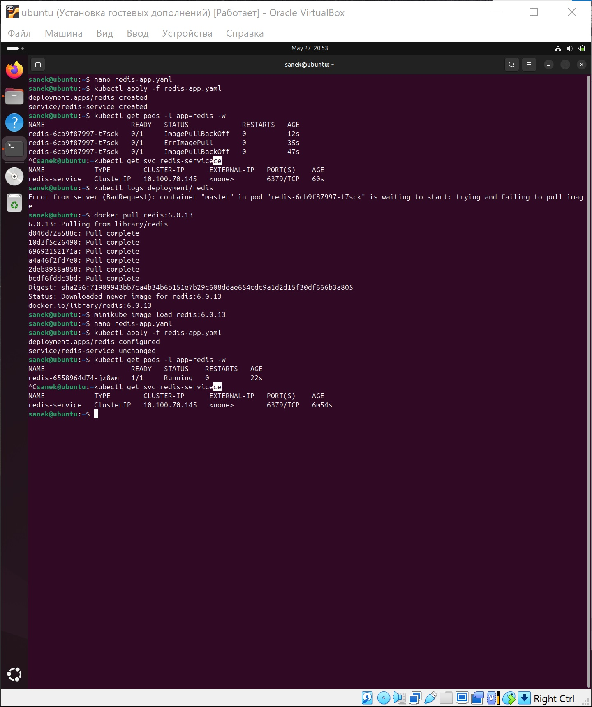

* Проверка логов контейнера (для подтверждения беспарольного режима)

kubectl logs deployment/redis

В логах вы увидите приветственное сообщение Redis и строку, подтверждающую готовность принимать соединения на порту 6379.

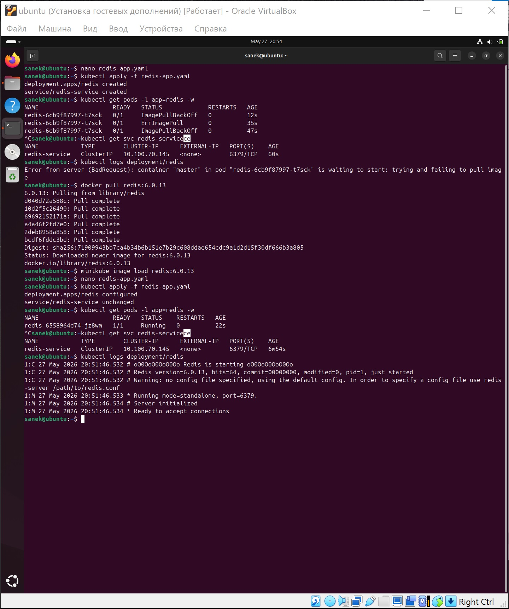

## Задача 3

1. Напишите команды kubectl для контейнера из предыдущего задания:

* выполнения команды ps aux внутри контейнера

- Узнаем имя пода

kubectl get pods

- Перенаправление репозиториев на архив

kubectl exec <pod_name> -- sh -c "echo 'deb http://archive.debian.org/debian/ buster main contrib non-free\ndeb http://archive.debian.org/debian-security buster/updates main contrib non-free' > /etc/apt/sources.list"

- Устанавливаем команду ps внутрь контейнера

kubectl exec <pod_name> -- apt-get update

- Установка пакета procps

kubectl exec <pod_name> -- apt-get install -y procps --allow-unauthenticated

- выполнения команды ps aux внутри контейнера;

kubectl exec <pod_name> -- ps aux

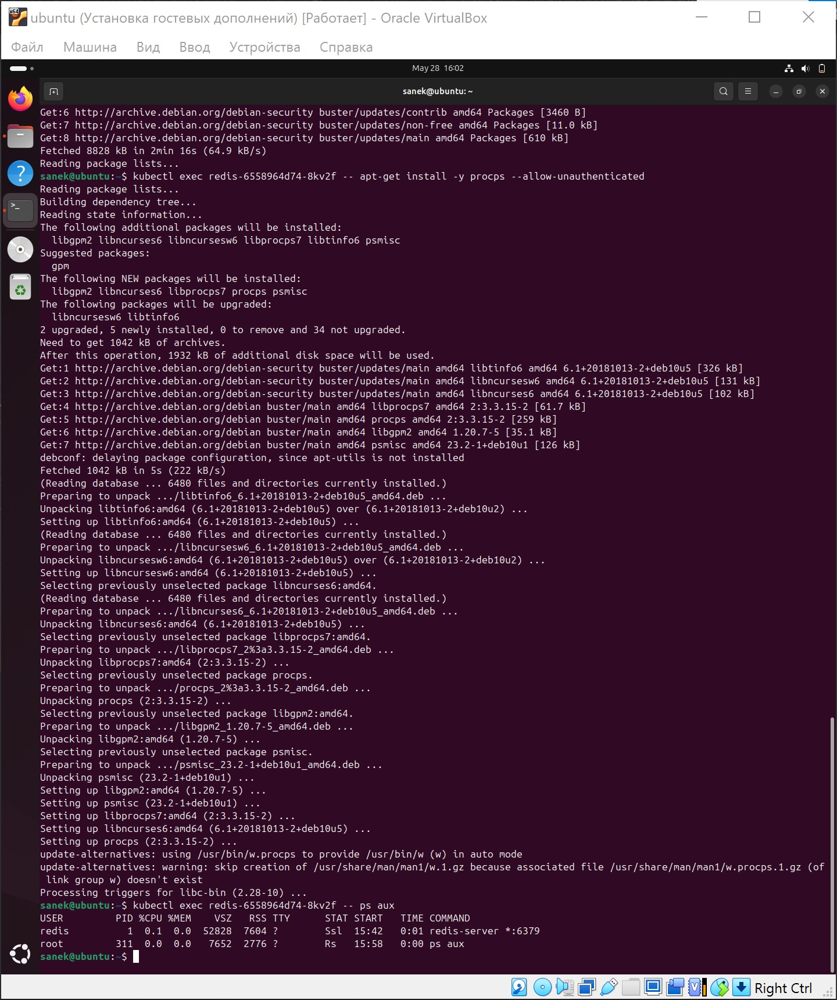

* просмотра логов контейнера за последние 5 минут;

kubectl logs <pod_name> --since=5m

kubectl logs <pod_name> --since=5m -f # флаг -f просмотр в реальном времени

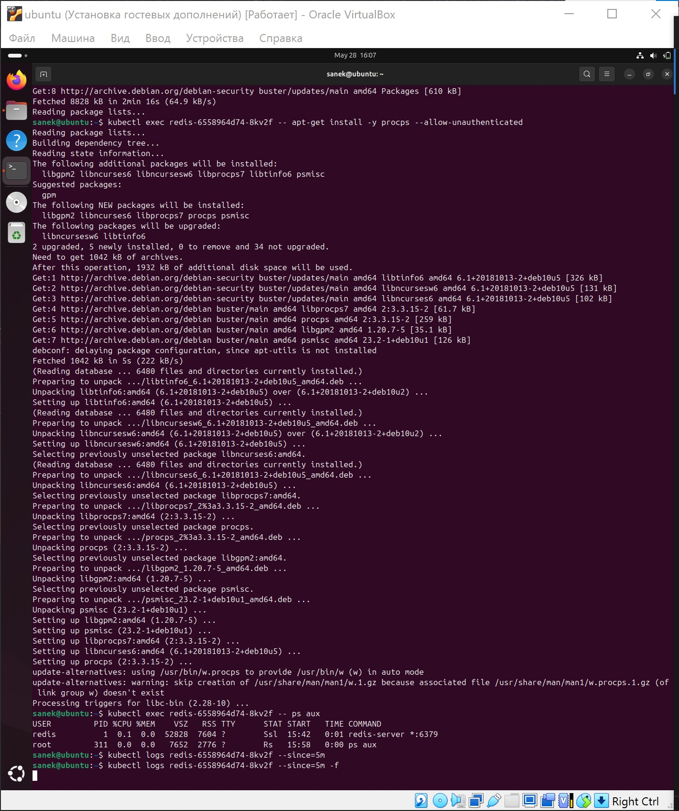

* проброса порта локальной машины в контейнер для отладки.

kubectl port-forward <pod_name> 6379:6379

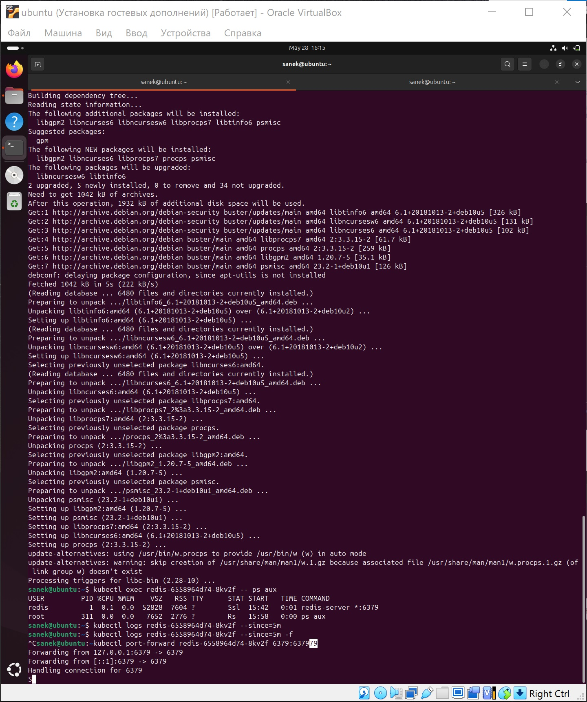

После запуска этой команды терминал заблокируется. Вы сможете открыть новое окно терминала на вашей Ubuntu и подключиться к базе данных без пароля с помощью команды redis-cli -p 6379 ping (в ответ должно прийти PONG). Чтобы остановить проброс портов, нажмите Ctrl + C.

sudo apt update && sudo apt install -y redis-tools

redis-cli -p 6379 ping

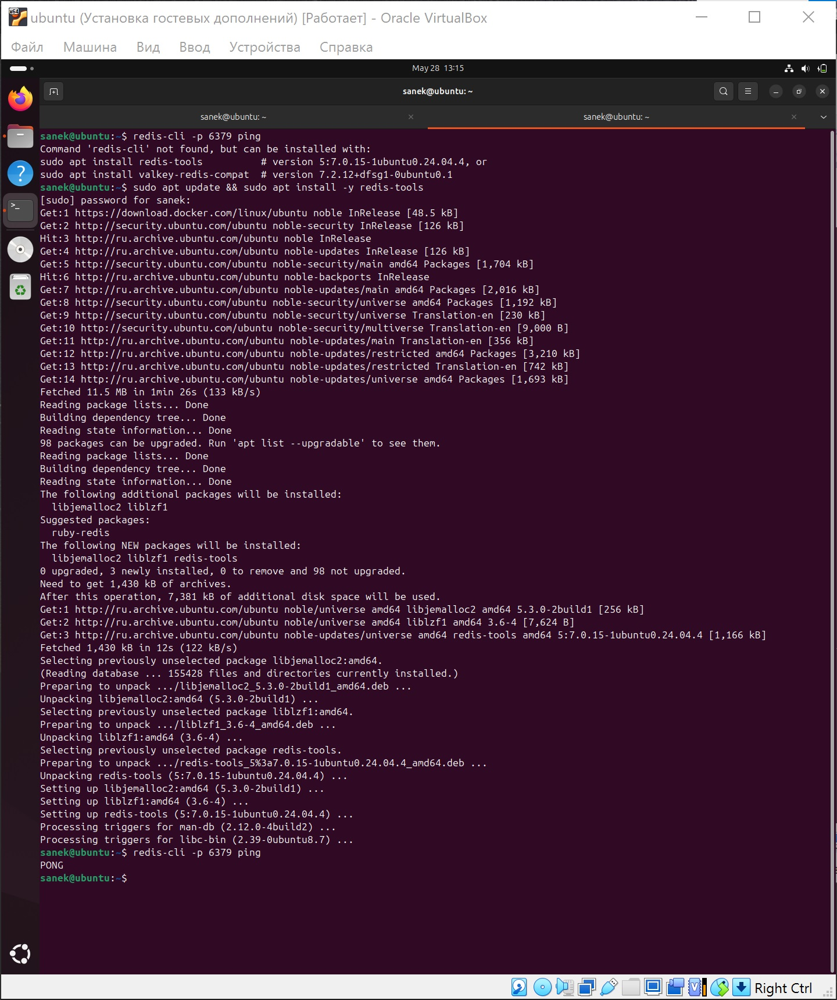

* удаления контейнера;

kubectl delete pod redis-6558964d74-8kv2f

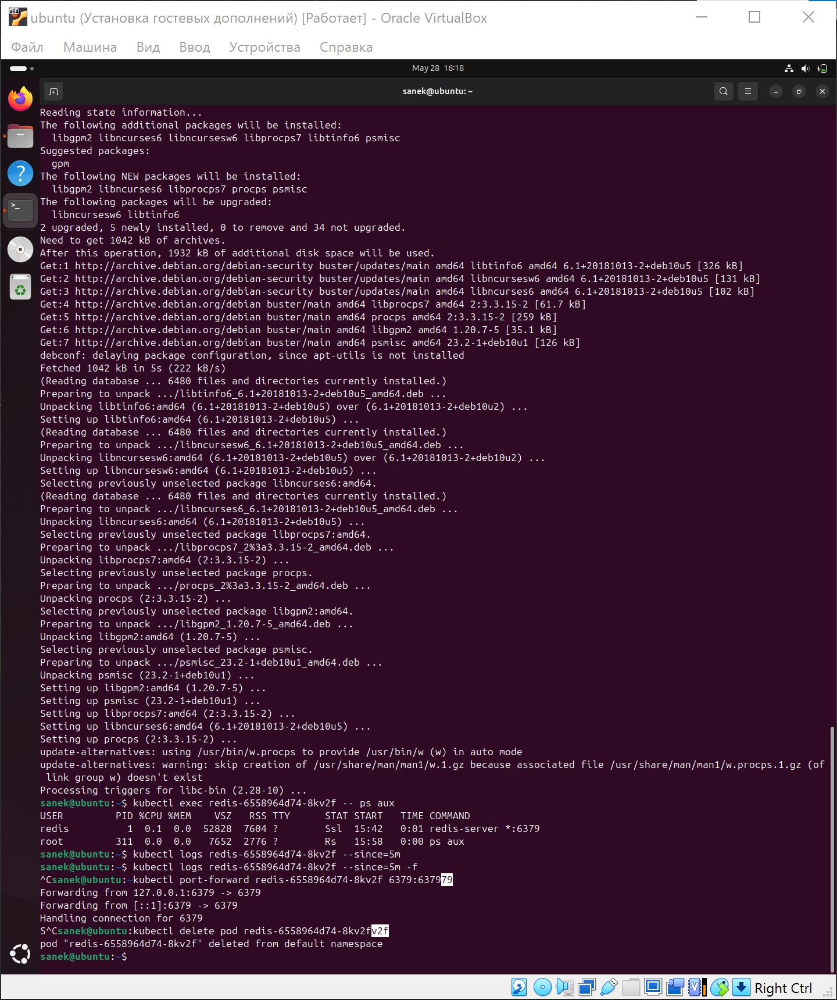